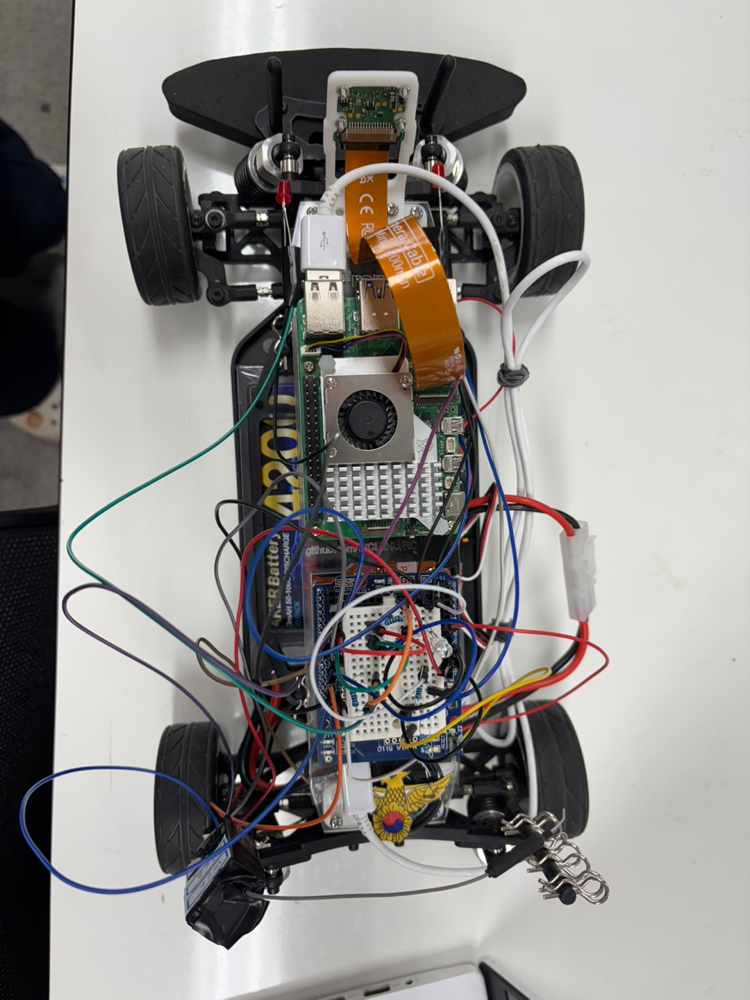
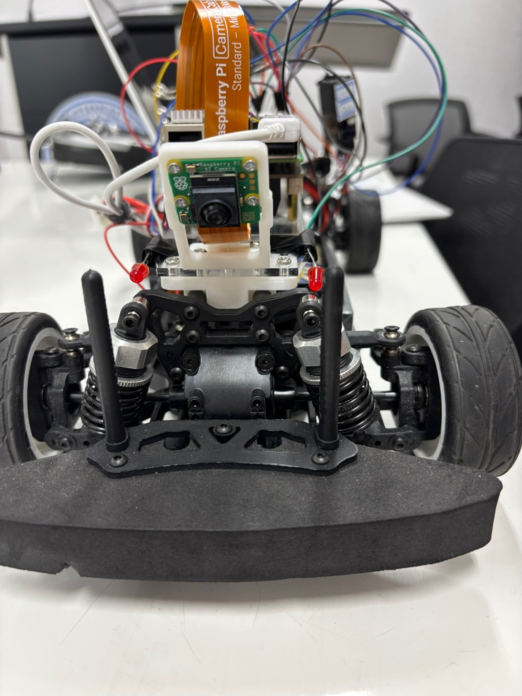
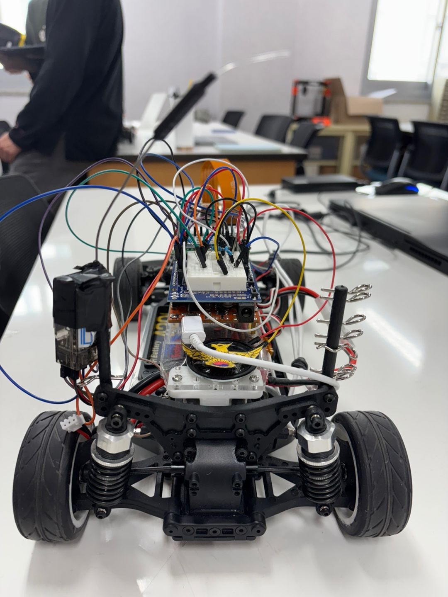
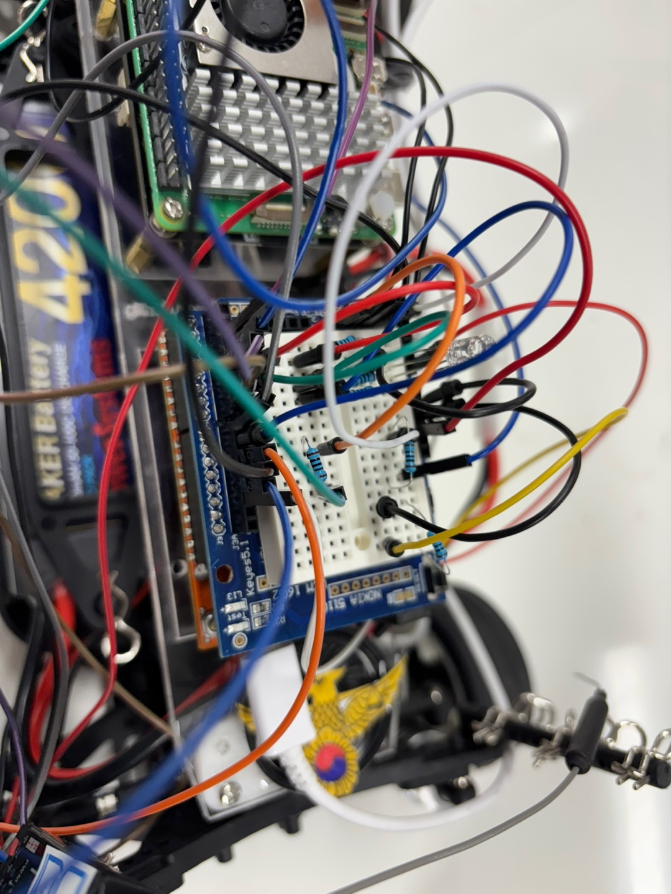
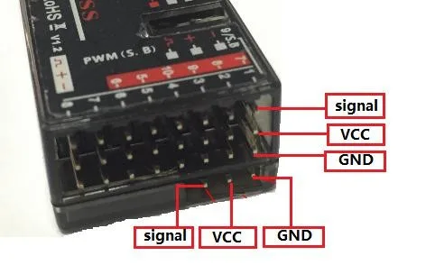
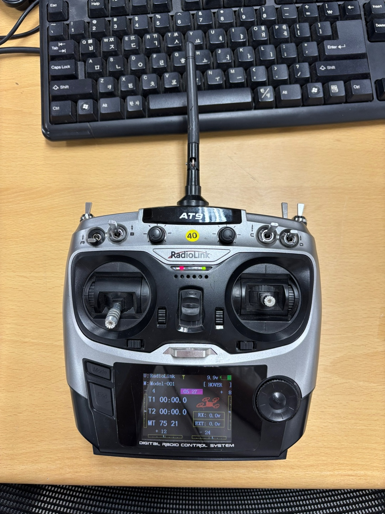
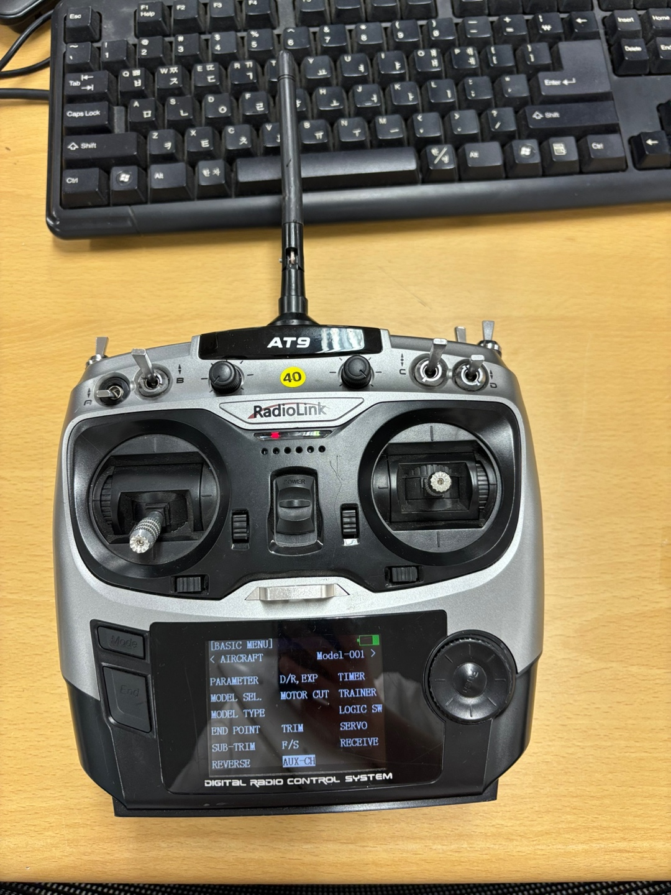

# 📌 [임베디드통신시스템] RC카 프로젝트

## 📖 소개
이 프로젝트는 [임베디드통신시스템] 강의의 일환으로, RC카에 아두이노와 라즈베리파이를 활용한 자율주행 및 수동조종 기능을 구현한 과제입니다. RC카는 조종기(AT9)로 수동 조작이 가능하며, 라즈베리파이 카메라를 이용한 라인 트레이싱을 통해 자율주행 모드로 전환할 수 있습니다. 또한 저희 팀은 RC카 컨셉을 경찰차로 잡았고 추가기능으로 사이렌 소리와, 삼색 LED로 경광등을 구현해 보았습니다. 

### 팀명 / 팀원    
염박 폴리 / 박근호, 염보은

### 팀원 구성원 담당 및 기여 부분 
 - 박근호:
   - 아두이노 코드의 전반적인 작성과 수정
   - 회로도 설계(공동)
   - 추가 기능 - 스피커로 경찰차소리 구현
   - RC카 조종 담당(수동 모드)
   - RC카 모드 설정 
- 염보은 : 
   - 라즈베리파이 코드의 전반적인 작성과 수정
   - 회로도 설계(공동)
   - 배터리 관리
   - 추가 기능 - 경찰차처럼 삼색 LED(빨, 파) 제어 구현
   - RC카 외형 정리(경찰 그림, 선 정리)   
      
   
   이후 조향, 속도 제어, 라인 인식은 함께 값을 조정하였습니다.    
   깃허브 작성은 박근호 팀원이 먼저 작성한 후 염보은 팀원이 수정과 추가 작업을 거쳤습니다. 
---

## 📝 과제 설명
1. 송수신기, 조종기를 이용하여 RC카 제어하기
2. 라즈베리파이와 카메라를 이용하여 라인트레이서 알고리즘 구현하기
3. 아두이노와 DC모터, 서보모터 연결 후 ESC의 PWM 신호 입력값 제어하기
4. PWM 신호 범위 조절하여 RC카의 속도를 적절하게 조정하고, 라인트레이서 트랙에서 자율주행 구현하기
5. LED를 이용하여 좌회전, 우회전, 후진 시에 불빛 들어오도록 하기
    - 좌회전시 좌측 LED blink
    - 우회전시 우측 LED blink
    - 후진시 양쪽 LED 모두 켜진 채로 유지
6. 경찰차 컨셉에 맞춘 스피커와 삼색 LED제어하기 (선택사항)


## 📢 구현 설명
- 수신기 CH1, CH2, CH5 채널을 이용하여 아두이노가 PWM 신호를 수신하고 ESC와 서보모터를 제어합니다.
- CH5(SWD 스위치)를 통해 수동/자율 모드를 전환합니다.
- 자율주행 모드에서는 라즈베리파이가 PiCamera2로 라인을 인식하고 편차(deviation)를 계산하여 시리얼로 아두이노에 전송합니다.
- 아두이노는 이 편차 값을 이용해 조향 각도를 조정합니다.
- RC카의 컨셉을 경찰차로 하여, 삼색 LED와 스피커를 추가하였습니다. 삼색 LED를 통해 빨강, 파랑 싸이렌 색을 구현하였고 아두이노 스피커를 이용해 소리를 구현하였습니다. (싸이렌 - SWB, 소리 - SWE)

추가 기능 중 삼색 LED 구현은 이전 과제를 참고하였습니다.   
[10주차 과제 아두이노 RC 기반 PWM제어를 통한 LED 컨트롤러](https://github.com/202301657/RCcar/tree/1dc325e3ec4114b41540657e9ddaed332602d1a8)

---

## 📌 핀 매핑 테이블

| 핀 번호 | 채널 | 용도               | 연결 대상           |
|---------|-------|--------------------|----------------------|
| 2       | ESC   | 전진/후진 제어     | ESC                  |
| 3       | SERVO | 좌/우 조향 제어    | 서보 모터            |
| 7       | CH2   | 속도 입력(전진/후진) | 조종기 수신기 CH1    |
| 8       | CH1   | 조향 입력(좌/우)    | 조종기 수신기 CH2    |
| 10      | CH5   | 모드 전환 스위치   | 조종기 수신기 CH5    |
| 4       | CH8   | 삼색 LED 제어  | 조종기 수신기 CH8    |
| 12      | CH6   | 사이렌 ON/OFF 제어  | 조종기 수신기 CH6    |
| 13      |  -    | 좌회전 LED (깜빡이) | -     |
| 11      |  -    | 우회전 LED (깜빡이) | -     |
| 5       |  -    | 빨강 PWM | -     |
| 6       |  -    | 초록 PWM | -     |
| 9       |  -    | 파랑 PWM | -     |

여기서의  6번 핀 연결은 사실상 사용되지 않았지만 추가 기능에서의 색 변환을 다양하게 하고 싶을 때 사용하실 수 있으므로 추가하였습니다. 

---

## 🎥 동작 시연 영상

아래 사진을 클릭하면 동작이 시연되는 것을 확인할 수 있습니다.


### 자율주행 모드
https://youtu.be/k9z942Rp7XE?si=IcaTrqKzausCTWcr

### 수동모드
https://youtu.be/tq9EZcV04DQ?si=RJwNqD1kFD56lEQ

---

## 🔩 하드웨어

이 프로젝트에 필요한 주요 부품은 다음과 같습니다:   
- 아두이노 UNO 보드
- Raspberry Pi 5 (PiCamera2 카메라 모듈 장착)
- 4륜 구동 RC카 섀시(RC카의 뼈대 역할을 하는 프레임)
- 전자 속도 제어기(ESC) 
- 조향용 서보모터
- 조종기 수신기(AT9S 호환)
- 전원 배터리 팩 (최대 8.4V)
- USB-TTL 케이블 (Raspberry Pi와 아두이노를 연결하는 용도)

아래 사진은 실제 구현된 RC카 모습의 사진입니다. 






---

## 💻 소프트웨어

### Arduino (아두이노)

- PWM 신호 수신 (CH1, CH2, CH5, CH6, CH8)
- 서보 모터 및 ESC 제어
- 시리얼 통신을 통해 라즈베리파이로부터 deviation 값 수신
- 수동/자율 모드 전환 구현
- RC카 조종에 따른 LED 제어 
- 추가 기능으로 구현한 스피커와 삼색 LED 제어

라즈베리파이에서 전송받은 편차값을 이용해 라인과 가까운 경우와 멀어지는 경우로 나누어 조향과 속도를 조정하였습니다. 라인과 멀어진 경우는 커브길을 의미하므로 속도값을 낮추었습니다. 

### Raspberry Pi (라즈베리파이)

1️⃣ PiCamera2로 영상을 실시간 캡처  
2️⃣ OpenCV로 라인 검출 (이진화 + ROI 분석)  
3️⃣ 편차(deviation) 계산: 중심선 대비 라인 위치  
4️⃣ 시리얼 통신으로 deviation 값을 아두이노에 전송

실시간 캡처된 영상에서 하단 부분을 활용하여 밝은 부분과 어두운 부분의 차이로 라인을 구분할 수 있으며 인식된 라인과 화면 중앙을 비교하여 편차값을 아두이노에 전송합니다. 

> 🔧 자세한 코드는 `Arduino/src/main.cpp`, `RaspberryPi/src/AIcamera.py`에 포함된 주석을 참고하시면 좋을 것 같습니다. 

--- 
## 조종기(AT9) 모드 설정 
조종기의 왼쪽에 보시면 Mode라고 써진 버튼을 클릭합니다.   

   

중간 아래에 있는 AUX-CH에 들어가면 채널 별로 어떤 스위치를 사용할 것인지 설정할 수 있습니다. 
   

저희 팀은 
- D스위치에 자율주행/수동 모드 조정
- B스위치로 삼색 LED on/off
- E스위치로 스피커 on/off 
- 오른쪽 스로틀로 전진/후진, 좌/우 제어

### 조종기 ESC 모드 변경    
조종기의 ESC 기본 모드 설정은 스로틀을 위로 올렸을 때 전진하고 후진을 하고 싶을 때 스로틀을 아래로 내리면 한 번 정지된 후 다시 아래로 내렸을 때 후진이 가능하도록 설정되어있습니다. 이는 조종시에 불편할 수 있으므로 ESC에 있는 버튼을 꾹 누르면 변경이 가능합니다. ESC모드를 변경하지 않으면 수동에서 불편한 문제도 있지만 자율주행모드시 값을 읽는 속도가 느릴 수 있습니다. 

---

## ⚠️ 주의 & 참고 사항

- 시리얼 포트(`/dev/ttyUSB0`, `/dev/ttyUSB1` 등)는 환경에 따라 변경될 수 있으므로 실제 포트 번호 확인 필요
- 시리얼 실행 도중 USB케이블을 뽑았다 다시 끼우는 경우 USB0과 1이 바뀔 수 있으니 주의
- 아두이노는 반드시 라즈베리파이와 동일한 GND로 연결해야 안정적인 시리얼 통신 가능
- ESC는 반드시 안전하게 배선 후 테스트할 것
- PiCamera2 설정은 해상도와 포맷을 영상처리 성능에 따라 조절 가능
- 시행 중 급발진 할 수 있으니 바퀴가 닿지 않게 RC카를 올려둔 상태로 시행해봐야할 것(저희는 큰 두루마리 휴지 사용했어요)
- 빛때문에 라인을 잘 인식하지 못하는 경우 라즈베리 파이에서 값을 낮추면 더 잘 보일 수 있음. (값 : 코드에서의 100을 수정)
``` 
    blur = cv2.GaussianBlur(gray, (5, 5), 0)  # 노이즈 제거를 위해 5x5 커널로 가우시안 블러를 적용합니다
    _, binary = cv2.threshold(
        blur, 0, 100, cv2.THRESH_BINARY_INV + cv2.THRESH_OTSU
    )
```
- 그림자 영향을 받을 수 있으므로 적당히 떨어진 거리에서 주행 테스트해보는 것도 참고하면 좋을 것 같습니다. 
- 배터리는 최대 8.4V까지 충전 가능하여 8V이상까지 충전시키는 것이 좋음. 계속 연결해놓을시 방전될 수 있으므로 주의 
- 조종기 배터리로는 AA건전지 8개가 필요한데 생각보다 금방 소모되므로 주의 

---

